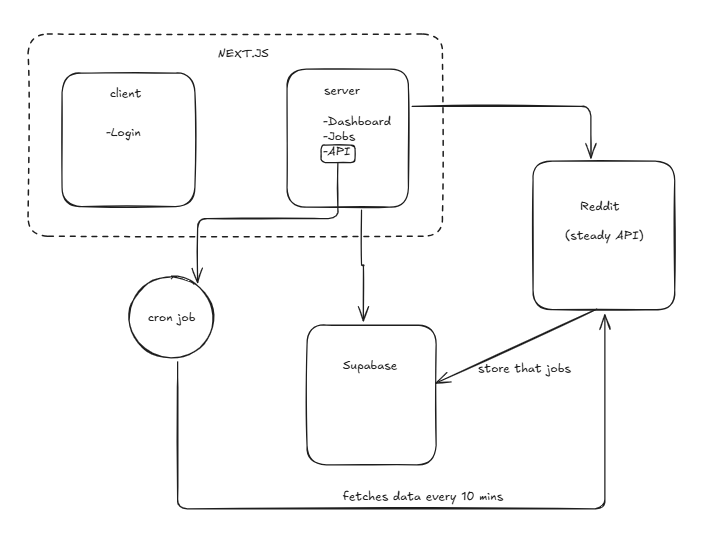

# Jobddit

Jobddit is a modern job-aggregation web app that combines Reddit scrapers, and user features to help job seekers discover, save, and evaluate job postings quickly. Built with Next.js (App Router) and Supabase, Jobddit focuses on realtime updates, simple saved-job management, and easy payments/webhooks integration.

live at: https://jobddit.vercel.app/

## Table of contents
- [Features](#features)
- [Tech stack](#tech-stack)
- [Architecture](#architecture)
- [Getting started](#getting-started)
  - [Prerequisites](#prerequisites)
  - [Install](#install)
  - [Environment variables](#environment-variables)
  - [Run locally](#run-locally)
- [Deployment](#deployment)
- [Folder overview](#folder-overview)
- [Contributing](#contributing)
- [License](#license)

## Features
- Aggregates job posts from Reddit and other sources (see `libs/reddit`).
- Client-side saved-jobs with persistent storage (Supabase).
- Realtime updates and pagination for job lists.
- AI-assisted job analysis (see `libs/ai/gemini-job-analyzer.ts`).
- Payment / checkout webhook integrations (Dodo example under `app/api/webhooks`).

## Tech stack
- Next.js (App Router, TypeScript)
- React + Server Components
- Supabase for auth, database, and storage
- Vercel for hosting (recommended)
- Optional: AI integrations (Gemini API), Reddit scraping scripts, and server cron jobs

## Architecture
This is the first basic architecture i drawn when i was starting to build jobddit.



## Getting started

### Prerequisites
- Node.js 18+ (or current LTS)
- npm, yarn, or pnpm
- A Supabase project (for dev and production)

### Install
```bash
git clone <your-repo-url>
cd jobddit
npm install
# or
pnpm install
```
